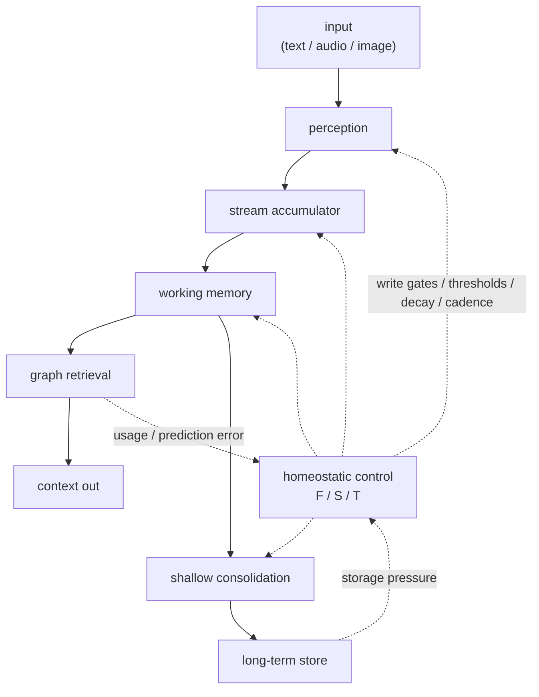

# Cortext

<p align="center">
  <strong>Local multimodal memory for AI apps, agents, devices, and humans.</strong>
</p>

<p align="center">
  <a href="https://github.com/augmem/cortext.cpp/releases"></a>
  <a href="LICENSE"></a>
  <a href="https://www.npmjs.com/package/@augmem/cortext"></a>
  <a href="https://pub.dev/packages/cortext"></a>
</p>

<p align="center">
  <a href="#install">Install</a> ·
  <a href="#repositories">Repositories</a> ·
  <a href="#how-it-works">How it works</a> ·
  <a href="#super-repo">Super-repo</a> ·
  <a href="#motivation">Motivation</a>
</p>

---

Cortext is a **C++20 memory engine** that ingests text, audio, and image signals, stores durable traces in SQLite, and returns a **small context packet** of relevant memories on later calls.

Use it when an assistant outlives its context window — instead of resending tens of thousands of history tokens or bolting on a separate RAG stack, ask Cortext for the current memory packet and inject the retrieval results into your model or UI.

| | |
| --- | --- |
| **Engine** | [`augmem/cortext.cpp`](https://github.com/augmem/cortext.cpp) — C++20 core, C ABI, CLI, paper, release assets |
| **Python** | [`augmem/cortext.py`](https://github.com/augmem/cortext.py) — `cortext` wheels (GitHub Releases) |
| **TypeScript / Node** | [`augmem/cortext.ts`](https://github.com/augmem/cortext.ts) — npm `@augmem/cortext` |
| **Go** | [`augmem/cortext.go`](https://github.com/augmem/cortext.go) — pure Go, no CGO |
| **Dart** | [`augmem/cortext.dart`](https://github.com/augmem/cortext.dart) — pub `cortext` |
| **WebAssembly** | [`augmem/cortext.wasm`](https://github.com/augmem/cortext.wasm) — npm `@augmem/cortext-wasm` |

This repository is the **git super-repo**: submodule pointers to every public Cortext surface, plus the brand home README. Implementation, tags, and release artifacts live in the language repos.

## Why Cortext

Most memory systems force a discrete mode switch — RAG vs chat history vs vector DB — and then drown the model in tokens. Cortext runs a **local feedback loop**:

- **Durable multimodal memory** — signal metadata in SQLite, payloads in sqlite-objstore, vectors via sqlite-vec
- **One embedding space** — text, audio, speech, and image share an AIST-87M GGUF retrieval model
- **Three control knobs** — Focus (**F**), Sensitivity (**S**), Stability (**T**) derive thresholds, decay, write cadence, consolidation, and retrieval width
- **Graph-native context** — reinforcement, sequence, soft anchors, consolidation, and supersession edges
- **Small native surface** — C++ facade, stable C ABI, and thin language bindings

On a public Meta Multi-Session Chat slice (hosted frontier judge): **Cortext won 7 of 9 probes** (21/27 blind rows) using **~998 context tokens/turn** vs **~49k** for traditional chat+RAG. Full protocols live in the engine paper under `cortext.cpp/docs/paper/`.

## Install

Pick a language surface. Engine release assets ship from **[`cortext.cpp` releases](https://github.com/augmem/cortext.cpp/releases)** (natives + model shards).

### Python

```bash
export CORTEXT_VERSION=1.2.4
pip install "cortext==${CORTEXT_VERSION}" \
  --find-links "https://github.com/augmem/cortext.py/releases/download/v${CORTEXT_VERSION}/index.html"
```

```python
import cortext

with cortext.Cortext(":memory:") as memory:
    memory.process_text("Bailey likes tennis balls.", "chat/main")
    ctx = memory.process_text("What does Bailey like?", "chat/query")
```

### Node.js / TypeScript

```bash
npm install @augmem/cortext
```

```ts
import { Cortext } from "@augmem/cortext";

const memory = await Cortext.create(":memory:");
await memory.processText("Bailey likes tennis balls.", "chat/main");
const ctx = await memory.processText("What does Bailey like?", "chat/query");
```

### Go

```bash
go get github.com/augmem/cortext.go@v1.2.4
```

```go
engine, err := cortext.New(":memory:", nil)
// ProcessText / EmbedText on engine
```

### Dart

```bash
dart pub add cortext
```

```dart
final memory = Cortext(dbPath: 'memory.sqlite');
memory.processText('Bailey likes tennis balls.', sourceId: 'chat/main');
```

### Browser (WASM)

```bash
npm install @augmem/cortext-wasm
```

```ts
import { CortextWasm } from "@augmem/cortext-wasm";
import createCortextModule from "@augmem/cortext-wasm/module";
```

### C++ engine

```bash
git clone https://github.com/augmem/cortext.cpp.git
cd cortext.cpp
cmake -S . -B build -DCMAKE_BUILD_TYPE=Release -DCORTEXT_BUILD_TOOLS=ON
cmake --build build -j --target cortext_cli
./build/tools/cli/cortext_cli --db bailey.db remember \
  "Bailey is allergic to bee stings."
./build/tools/cli/cortext_cli --db bailey.db recall \
  "what should the vet know?"
```

## Repositories

| Path (submodule) | Remote | Package | Role |
| --- | --- | --- | --- |
| [`cortext.cpp`](cortext.cpp) | [augmem/cortext.cpp](https://github.com/augmem/cortext.cpp) | — | C++20 engine, C ABI, CLI, paper, **release assets** |
| [`cortext.py`](cortext.py) | [augmem/cortext.py](https://github.com/augmem/cortext.py) | `cortext` (wheels) | Pure-Python ctypes + platform natives |
| [`cortext.ts`](cortext.ts) | [augmem/cortext.ts](https://github.com/augmem/cortext.ts) | `@augmem/cortext` | Node N-API dual package (ESM + CJS) |
| [`cortext.go`](cortext.go) | [augmem/cortext.go](https://github.com/augmem/cortext.go) | `github.com/augmem/cortext.go` | Pure Go FFI, no CGO |
| [`cortext.dart`](cortext.dart) | [augmem/cortext.dart](https://github.com/augmem/cortext.dart) | `cortext` (pub) | Dart FFI for desktop/server |
| [`cortext.wasm`](cortext.wasm) | [augmem/cortext.wasm](https://github.com/augmem/cortext.wasm) | `@augmem/cortext-wasm` | Browser WebAssembly |

Plugins and demos (separate repos, not submodules here):  
[`cortext-openclaw-plugin`](https://github.com/augmem/cortext-openclaw-plugin) ·
[`cortext-hermes-plugin`](https://github.com/augmem/cortext-hermes-plugin) ·
[`cortext-cpa-plugin`](https://github.com/augmem/cortext-cpa-plugin)

## How it works



Retention policies on process calls:

| Policy | Boundary | Store | Typical use |
| --- | :---: | :---: | --- |
| **Natural** (default) | episode decides | write gate | continuous streams |
| **Durable** | force | force | explicit chat turns |
| **Boundary** | force | write gate | turn edges without forced store |
| **Ephemeral** | force | never | recall / query without write |

## Super-repo

This tree is a **git submodule superproject**. Each language repo stays independent for tags, CI, and packages. The super-repo pins known-good commits for coordinated checkouts and contributor orientation.

### Clone everything

```bash
git clone --recurse-submodules https://github.com/augmem/cortext.git
cd cortext
```

Already cloned without submodules?

```bash
git submodule update --init --recursive
```

### Layout

```text
cortext/                 # this super-repo (augmem/cortext)
├── README.md            # brand home
├── LICENSE
├── .gitmodules
├── cortext.cpp/         # engine submodule
├── cortext.py/          # Python submodule
├── cortext.ts/          # TypeScript / Node submodule
├── cortext.go/          # Go submodule
├── cortext.dart/        # Dart submodule
└── cortext.wasm/        # WASM submodule
```

### Update submodule pins

```bash
# Advance one surface to its remote main tip
git submodule update --remote cortext.cpp
git add cortext.cpp
git commit -m "chore: bump cortext.cpp submodule"

# Or refresh all tracked branches
git submodule update --remote --merge
```

### Contribute

- **Engine / ABI / paper / release assets** → open PRs on [`cortext.cpp`](https://github.com/augmem/cortext.cpp)
- **Language packages** → open PRs on the matching binding repo
- **Super-repo only** → README, submodule pins, org-level docs

Do not invent a monorepo build that flattens package identity. Consumers install from language package registries and engine releases, not from this umbrella alone.

## Motivation

Cortext began for a personal reason. In 2022, Gabriel Willen's father-in-law was diagnosed with dementia. The long-term goal is memory augmentation that helps people preserve continuity, confidence, and independence.

The same architecture is useful for long-horizon LLM memory, but the primary motivation is human: a realtime system that notices what matters, surfaces relevant context, and does not force the user to manage memory by hand.

## License

Apache-2.0. See [LICENSE](LICENSE). Individual submodules may carry their own `NOTICE` files for third-party attributions.
